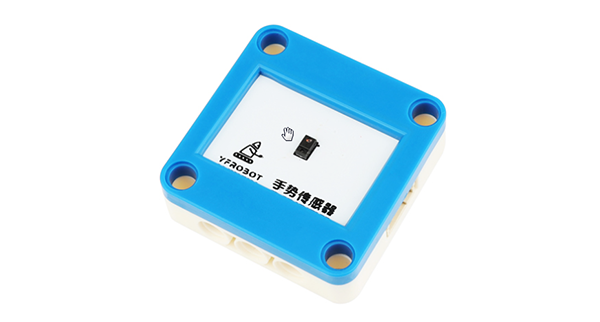
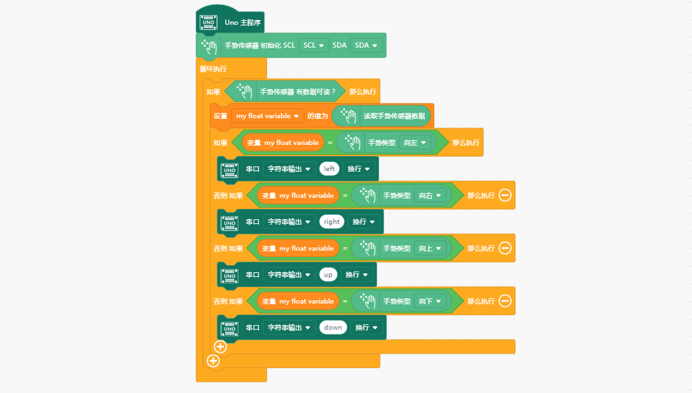

# YFROBOT 手势识别传感器（APDS-9960）

## 简介 Introduction

本扩展库为Mind+软件设计。

支持 YFROBOT APDS-9960 手势识别传感器。模块能够识别你手的运动方向，可以作为各种开关的触发装置，来帮助你实现智能控制。此外它还是一个颜色和光强传感器，可以分辨 RGB 三基色的各类组合。 模块采用了 APDS-9960 传感器，集成 RGB、环境光、近程和手势传感器模块。I2C 接口保证了它的可使用性，近程和手势检测配有红外 LED。RGB 和环境光检测功能可在多种光条件下以及通过多种减振材料包括深色玻璃的情况下，检测出光强度。此外，集成 UV-IR 遮光滤光片可实现精准的环境光和相关色温检测。着实是一款非常棒的传感器！

注意：目前本用户库只设计了手势识别相关功能。RGB、环境光检测功能暂未加入。

## 相关链接 Links
* 本项目加载链接: https://github.com/YFROBOT-TM

* 产品购买链接: [YFROBOT商城](https://www.yfrobot.com/)、[YFROBOT淘宝商城](https://yfrobot.taobao.com/).

## 积木列表 Blocks

## 示例程序 Examples

## 许可证 License
MIT

## 硬件支持列表 Hardware Support
主板型号                | 实时模式    | ArduinoC   | MicroPython    | 备注
------------------ | :----------: | :----------: | :---------: | -----
arduino uno        |             |       √已测试       |             | 
micro:bit        |             |       √未测试       |             | 
mpython掌控板        |             |        √未测试      |             | 

## 更新日志 Release Note
- V0.0.1  基础功能完成，Mind+V1.7.1 RC2.0版本软件测试

## 联系我们 Contact Us
* http://www.yfrobot.com.cn/wiki/index.php?title=%E8%81%94%E7%B3%BB%E6%88%91%E4%BB%AC

## 参考 Reference Resources
* GitHub：[https://github.com/chenzhongxian/ext-APDS-9960-Gesture](https://github.com/chenzhongxian/ext-APDS-9960-Gesture)

